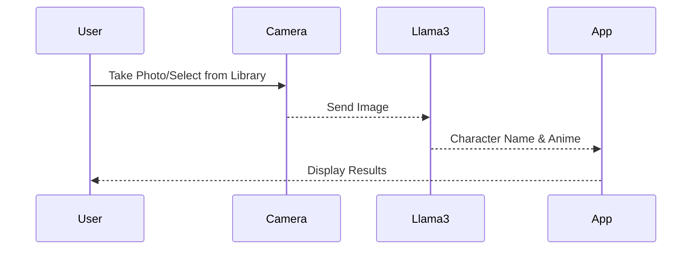

# Anime Character Identifier APP
Basic Development Specification Document
Version 1.0
Last Updated: November 10, 2024

## Table of Contents
1. [Product Overview](#1-product-overview)
2. [Process Flow](#2-process-flow)
3. [Project Structure](#3-project-structure)
4. [Technical Implementation](#4-technical-implementation)
5. [API Integration](#5-api-integration)
6. [UI/UX Implementation](#6-ui-ux-implementation)
7. [Error Handling](#7-error-handling)
8. [Testing Strategy](#8-testing-strategy)

## 1. Product Overview

### Purpose
A simple iOS application that enables users to:
1. Take photos of anime characters
2. Identify the character name and anime series
3. Display basic character information

### Features
- Camera/Photo Library integration
- Character identification using Llama3
- Basic information display

## 2. Process Flow



## 3. Project Structure

```
anime_character_identifier_app/
├── Sources/
│   ├── App/
│   │   ├── AppDelegate.swift
│   │   └── SceneDelegate.swift
│   ├── Features/
│   │   ├── Home/
│   │   │   ├── HomeViewController.swift
│   │   │   ├── HomeViewModel.swift
│   │   │   └── Views/
│   │   │       ├── InstructionView.swift
│   │   │       └── CameraButton.swift
│   │   ├── Camera/
│   │   │   ├── CameraViewController.swift
│   │   │   └── CameraViewModel.swift
│   │   └── Results/
│   │       ├── ResultsViewController.swift
│   │       └── ResultsViewModel.swift
│   ├── Services/
│   │   ├── CameraService.swift
│   │   ├── Llama3Service.swift
│   │   └── NetworkService.swift
│   └── Models/
│       └── CharacterInfo.swift
├── Tests/
├── LICENSE
└── README.md
```

## 4. Technical Implementation

### Camera Implementation
```swift
import AVFoundation
import Photos

class CameraService {
    static let shared = CameraService()
    private var captureSession: AVCaptureSession?
    private let photoOutput = AVCapturePhotoOutput()
    
    func requestPermissions() async throws -> Bool {
        // Camera permission implementation
    }
    
    func setupCamera() throws {
        guard let device = AVCaptureDevice.default(.builtInWideAngleCamera, for: .video, position: .back) else {
            throw CameraError.deviceNotAvailable
        }
        let input = try AVCaptureDeviceInput(device: device)
        
        captureSession = AVCaptureSession()
        captureSession?.addInput(input)
        captureSession?.addOutput(photoOutput)
        captureSession?.startRunning()
    }
}
```

### Llama3 Integration
```swift
class Llama3Service {
    struct CharacterIdentification: Codable {
        let name: String
        let animeName: String
    }
    
    func identifyCharacter(_ image: UIImage) async throws -> CharacterIdentification {
        let base64Image = image.base64EncodedString()
        
        let requestBody: [String: Any] = [
            "image": base64Image,
            "prompt": "Identify the anime character in this image and the anime they're from",
            "temperature": 0.7,
            "max_tokens": 100
        ]
        
        return try await performIdentification(requestBody)
    }
}
```

## 5. UI/UX Implementation

### HomeViewController
```swift
class HomeViewController: UIViewController {
    private let titleLabel = UILabel()
    private let instructionView = InstructionView()
    private let cameraButton = CameraButton()
    
    override func viewDidLoad() {
        super.viewDidLoad()
        setupUI()
    }
    
    private func setupUI() {
        view.backgroundColor = .systemBackground
        setupTitleLabel()
        setupInstructionView()
        setupCameraButton()
    }
}
```

### ResultsViewController
```swift
class ResultsViewController: UIViewController {
    private let characterNameLabel = UILabel()
    private let animeNameLabel = UILabel()
    
    init(character: CharacterIdentification) {
        super.init(nibName: nil, bundle: nil)
        characterNameLabel.text = "Character: \(character.name)"
        animeNameLabel.text = "Anime: \(character.animeName)"
    }
}
```

## 6. Error Handling

```swift
enum AppError: Error {
    case camera(CameraError)
    case identification(Llama3Error)
    
    var userMessage: String {
        switch self {
        case .camera(let error):
            return "Camera error: \(error.localizedDescription)"
        case .identification(let error):
            return "Could not identify character: \(error.localizedDescription)"
        }
    }
}

class ErrorHandler {
    static func handle(_ error: AppError, in viewController: UIViewController) {
        let alert = UIAlertController(
            title: "Error",
            message: error.userMessage,
            preferredStyle: .alert
        )
        alert.addAction(UIAlertAction(title: "OK", style: .default))
        viewController.present(alert, animated: true)
    }
}
```

## 7. Testing Strategy

### Unit Tests
```swift
class Llama3ServiceTests: XCTestCase {
    var sut: Llama3Service!
    
    func testCharacterIdentification() async throws {
        // Test implementation
    }
}

class CameraServiceTests: XCTestCase {
    var sut: CameraService!
    
    func testCameraSetup() throws {
        // Test implementation
    }
}
```

### UI Tests
```swift
class BasicFlowTests: XCTestCase {
    var app: XCUIApplication!
    
    override func setUp() {
        super.setUp()
        app = XCUIApplication()
        app.launch()
    }
    
    func testBasicFlow() {
        // Test implementation
    }
}
```
