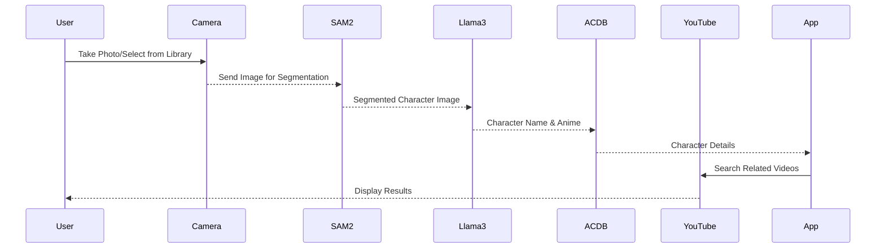

# Anime Character Identifier APP
Complete Development Specification Document
Version 2.0
Last Updated: November 10, 2024

## Table of Contents
1. [Product Overview](#1-product-overview)
2. [Process Flow](#2-process-flow)
3. [Project Structure](#3-project-structure)
4. [Technical Implementation](#4-technical-implementation)
5. [API Integration](#5-api-integration)
6. [UI/UX Implementation](#6-ui-ux-implementation)
7. [Error Handling](#7-error-handling)
8. [Testing Strategy](#8-testing-strategy)

## 1. Product Overview

### Purpose
An iOS application that enables users to:
1. Capture/select photos of anime characters
2. Segment and identify the character using AI
3. Display character and anime information
4. Show related YouTube videos

### Features
- Camera/Photo Library integration
- Character segmentation (SAM2)
- Character identification (Llama3)
- Anime database integration (ACDB)
- YouTube video recommendations

## 2. Process Flow



### Data Flow Steps
1. User Input
   - Capture photo using camera
   - Select photo from library
   
2. Image Processing
   - SAM2 segments character from image
   - Llama3 identifies character and anime
   
3. Information Retrieval
   - Query ACDB for character details
   - Search YouTube for related videos
   
4. Results Display
   - Show character information
   - Display related videos

## 3. Project Structure

```
anime_character_identifier_app/
├── anime_character_identifier_app/
│   ├── Core/
│   │   ├── AppDelegate.swift
│   │   └── SceneDelegate.swift
│   ├── Features/
│   │   ├── Camera/
│   │   │   ├── CameraViewController.swift
│   │   │   └── CameraViewModel.swift
│   │   ├── Recognition/
│   │   │   ├── RecognitionService.swift
│   │   │   └── RecognitionViewModel.swift
│   │   ├── Results/
│   │   │   ├── ResultsViewController.swift
│   │   │   └── ResultsViewModel.swift
│   │   └── YouTube/
│   │       ├── YouTubeService.swift
│   │       └── YouTubeViewModel.swift
│   ├── Services/
│   │   ├── SAM2Service.swift
│   │   ├── Llama3Service.swift
│   │   ├── ACDBService.swift
│   │   └── NetworkService.swift
│   ├── Models/
│   │   ├── CharacterInfo.swift
│   │   ├── VideoInfo.swift
│   │   └── APIResponses.swift
│   └── Utils/
│       ├── Extensions/
│       └── Constants.swift
├── anime_character_identifier_appTests/
├── anime_character_identifier_appUITests/
└── Podfile
```

## 4. Technical Implementation

### Camera Implementation
```swift
import AVFoundation
import Photos

class CameraManager {
    static let shared = CameraManager()
    private var captureSession: AVCaptureSession?
    private let photoOutput = AVCapturePhotoOutput()
    
    func requestPermissions() async throws -> Bool {
        // Camera permission implementation
    }
    
    func setupCamera() throws {
        guard let device = AVCaptureDevice.default(.builtInWideAngleCamera, for: .video, position: .back) else {
            throw CameraError.deviceNotAvailable
        }
        // Camera setup implementation
    }
    
    func capturePhoto() async throws -> UIImage {
        // Photo capture implementation
    }
}

extension CameraManager: AVCapturePhotoCaptureDelegate {
    func photoOutput(_ output: AVCapturePhotoOutput, 
                    didFinishProcessingPhoto photo: AVCapturePhoto, 
                    error: Error?) {
        // Photo processing implementation
    }
}
```

### SAM2 Integration
```swift
class SAM2Service {
    private let runpodEndpoint: String
    
    struct SegmentationRequest: Codable {
        let input: Input
        
        struct Input: Codable {
            let action: String
            let image_url: String
        }
    }
    
    struct SegmentationResponse: Codable {
        let segmented_image: String
        let bbox: [Float]
    }
    
    func segmentCharacter(_ image: UIImage) async throws -> UIImage {
        // 1. Upload to bytescale
        let imageUrl = try await uploadImage(image)
        
        // 2. Process with SAM2
        let request = SegmentationRequest(
            input: .init(
                action: "process_single_image",
                image_url: imageUrl
            )
        )
        
        return try await processWithSAM2(request)
    }
    
    private func processWithSAM2(_ request: SegmentationRequest) async throws -> UIImage {
        // SAM2 processing implementation
    }
}
```

### Llama3 Integration
```swift
class Llama3Service {
    struct CharacterIdentification: Codable {
        let name: String
        let animeName: String
        let confidence: Float
    }
    
    func identifyCharacter(_ segmentedImage: UIImage) async throws -> CharacterIdentification {
        let base64Image = segmentedImage.base64EncodedString()
        
        let requestBody: [String: Any] = [
            "image": base64Image,
            "prompt": "Identify the anime character in this image",
            "temperature": 0.7,
            "max_tokens": 100
        ]
        
        // Llama3 API call implementation
        return try await performIdentification(requestBody)
    }
}
```

### ACDB Integration
```swift
class ACDBService {
    static let baseURL = "https://www.animecharactersdatabase.com"
    static let userAgent = "AnimeIdentifierApp/1.0"
    
    struct CharacterDetails: Codable {
        let id: Int
        let name: String
        let animeName: String
        let description: String
        let imageUrl: String
    }
    
    private let rateLimiter = RateLimiter(requestsPerSecond: 1)
    
    func getCharacterInfo(_ name: String) async throws -> CharacterDetails {
        try await rateLimiter.execute {
            var request = URLRequest(url: URL(string: "\(Self.baseURL)?character_q=\(name)")!)
            request.addValue(Self.userAgent, forHTTPHeaderField: "User-Agent")
            return try await performRequest(request)
        }
    }
}

class RateLimiter {
    private let requestsPerSecond: Int
    private var lastRequestTime: Date = .distantPast
    
    init(requestsPerSecond: Int) {
        self.requestsPerSecond = requestsPerSecond
    }
    
    func execute<T>(_ block: () async throws -> T) async throws -> T {
        // Rate limiting implementation
    }
}
```

### YouTube Integration
```swift
class YouTubeService {
    private let apiKey: String
    static let baseURL = "https://www.googleapis.com/youtube/v3"
    
    struct VideoResult: Codable {
        let videoId: String
        let title: String
        let thumbnailUrl: String
        let description: String
    }
    
    func searchVideos(character: String, anime: String) async throws -> [VideoResult] {
        let query = "\(character) \(anime) anime"
        let parameters: [String: Any] = [
            "part": "id,snippet",
            "q": query,
            "maxResults": 10,
            "type": "video",
            "key": apiKey
        ]
        
        return try await performSearch(parameters)
    }
}
```

## 5. API Integration

### Combined Service Coordinator
```swift
class ServiceCoordinator {
    private let sam2Service: SAM2Service
    private let llama3Service: Llama3Service
    private let acdbService: ACDBService
    private let youtubeService: YouTubeService
    
    func processImage(_ image: UIImage) async throws -> (CharacterDetails, [VideoResult]) {
        // 1. Segment character
        let segmentedImage = try await sam2Service.segmentCharacter(image)
        
        // 2. Identify character
        let identification = try await llama3Service.identifyCharacter(segmentedImage)
        
        // 3. Get character details
        let characterDetails = try await acdbService.getCharacterInfo(identification.name)
        
        // 4. Get related videos
        let videos = try await youtubeService.searchVideos(
            character: identification.name,
            anime: identification.animeName
        )
        
        return (characterDetails, videos)
    }
}
```

## 6. UI/UX Implementation

### Main View Controller
```swift
class MainViewController: UIViewController {
    private let cameraButton = UIButton()
    private let libraryButton = UIButton()
    private let processingView = ProcessingView()
    
    override func viewDidLoad() {
        super.viewDidLoad()
        setupUI()
    }
    
    private func setupUI() {
        // UI setup implementation
    }
    
    @objc private func captureImage() {
        // Image capture implementation
    }
}
```

### Results View Controller
```swift
class ResultsViewController: UIViewController {
    private let characterInfoView = CharacterInfoView()
    private let videoCollectionView: UICollectionView
    
    init(character: CharacterDetails, videos: [VideoResult]) {
        super.init(nibName: nil, bundle: nil)
        setupViews(character: character, videos: videos)
    }
    
    private func setupViews(character: CharacterDetails, videos: [VideoResult]) {
        // View setup implementation
    }
}
```

### Custom Views
```swift
class CharacterInfoView: UIView {
    private let nameLabel = UILabel()
    private let animeLabel = UILabel()
    private let characterImageView = UIImageView()
    
    func configure(with character: CharacterDetails) {
        nameLabel.text = character.name
        animeLabel.text = character.animeName
        // Configure rest of the view
    }
}

class VideoCollectionViewCell: UICollectionViewCell {
    private let thumbnailImageView = UIImageView()
    private let titleLabel = UILabel()
    
    func configure(with video: VideoResult) {
        titleLabel.text = video.title
        // Configure rest of the cell
    }
}
```

## 7. Error Handling

```swift
enum AppError: Error {
    case camera(CameraError)
    case segmentation(SAM2Error)
    case identification(Llama3Error)
    case characterInfo(ACDBError)
    case youtube(YouTubeError)
    
    var userMessage: String {
        switch self {
        case .camera(let error):
            return "Camera error: \(error.localizedDescription)"
        case .segmentation(let error):
            return "Could not process image: \(error.localizedDescription)"
        case .identification(let error):
            return "Could not identify character: \(error.localizedDescription)"
        case .characterInfo(let error):
            return "Could not fetch character info: \(error.localizedDescription)"
        case .youtube(let error):
            return "Could not fetch videos: \(error.localizedDescription)"
        }
    }
}

class ErrorHandler {
    static func handle(_ error: AppError, in viewController: UIViewController) {
        let alert = UIAlertController(
            title: "Error",
            message: error.userMessage,
            preferredStyle: .alert
        )
        alert.addAction(UIAlertAction(title: "OK", style: .default))
        viewController.present(alert, animated: true)
    }
    
    static func retry<T>(_ operation: () async throws -> T,
                        maxAttempts: Int = 3) async throws -> T {
        // Retry logic implementation
    }
}
```

## 8. Testing Strategy

### Unit Tests
```swift
class SAM2ServiceTests: XCTestCase {
    var sut: SAM2Service!
    
    override func setUp() {
        super.setUp()
        sut = SAM2Service()
    }
    
    func testImageSegmentation() async throws {
        // Test implementation
    }
}

class Llama3ServiceTests: XCTestCase {
    var sut: Llama3Service!
    
    func testCharacterIdentification() async throws {
        // Test implementation
    }
}

class ACDBServiceTests: XCTestCase {
    var sut: ACDBService!
    
    func testRateLimiting() async throws {
        // Test implementation
    }
}
```

### Integration Tests
```swift
class ServiceIntegrationTests: XCTestCase {
    var coordinator: ServiceCoordinator!
    
    func testCompleteImageProcessFlow() async throws {
        // Test implementation
    }
}
```

### UI Tests
```swift
class UIFlowTests: XCTestCase {
    var app: XCUIApplication!
    
    override func setUp() {
        super.setUp()
        app = XCUIApplication()
        app.launch()
    }
    
    func testCameraCapture() {
        // Test implementation
    }
    
    func testPhotoLibrarySelection() {
        // Test implementation
    }
}
```
